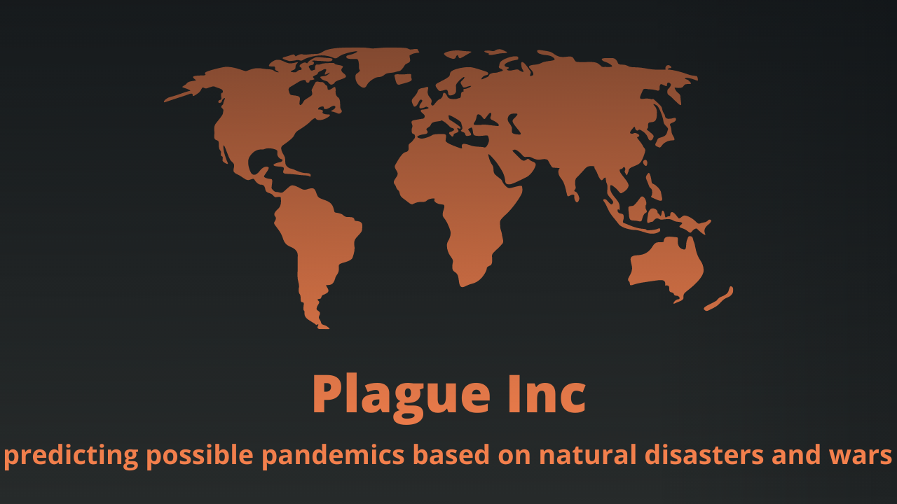
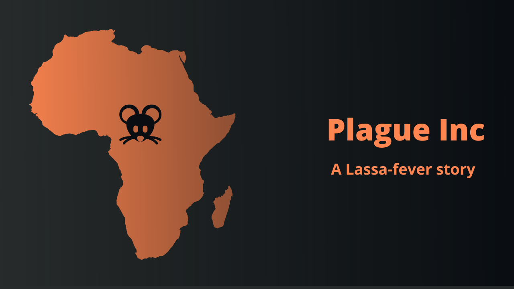

# Plague Inc
**Developers: [Sándor Burián](https://www.linkedin.com/in/sandor-burian), [Vince Molnár](https://www.linkedin.com/in/vince-moln%C3%A1r-4632191a3?miniProfileUrn=urn%3Ali%3Afs_miniProfile%3AACoAAC-NWEsB0R33ReLNEcYmNQIguMi0-lBYPhw&lipi=urn%3Ali%3Apage%3Ad_flagship3_search_srp_people%3B%2FVwg4S7gQQmd5Xw43x852g%3D%3D), [Dávid Kamenár](https://hu.linkedin.com/in/david-kamenar-1178b312a?trk=people-guest_people_search-card)**

hackathon link: [CraftHub - Junction app](http://web.archive.org/web/20220424114040/https://app.hackjunction.com/projects/hack-and-heal-hybrid-hackathon-2022/view/623e48300ccebc004ac63745) - Created on [*HackHeal Hackathon in 2022*](https://hacknheal.crafthub.events/)

***Our project tries to forecast incoming epidemics, based on previous pandemics, natural disasters, and war-like situations datasets.***

> Our idea is to use big data technologies to predict possible epidemics and pandemics based on earlier epidemics, using the current and the historical data of natural disasters, wars and some common things like economic and healthcare levels.
>
> **How do we imagine this?**
>
> We want to use as much possible kind of information as it is possible to see the correlation between epidemics in specified fields. The existing methods are just a few kinds of a dataset to predict things like this. But we think *as an example, we can use data of medieval Europe in cases of some modern third world countries too*. We think that not the time, but the context is what can define what is usable and what is not.
> 

**In this short session we have**
- collected data on pandemics
- collected data on natural disasters
- collected data on wartime situations
- researched for methods which are used to compare epidemics like this situation 
- created the simulation

Let's see a possible usage of this program, please watch this short video on YouTube about a possible use case *(2 min)*: 

----

## Methodology
For this we are using incidence, based on the time period of the disaster and number of ill people of the specified epidemic. This we can write as the following equation:

}})

*Of course we have to mention that may occur confounding in these simulations because we didn't observe each case, only the simulation based on the actual cases. Also, we have to mention that there will be so many other factors what we didn't take in our model, such as weather or economical situations of each region.*

Here we have to mention that our simulation is based only on Zika virus and Ebola outbreaks in the shadow of wars and natural disasters. This is just the presentation of the possibility that we can see the relations between such events and we can update this idea to another level by including more epidemics and many more social factors. 

For this we used several studies:
- CDC. (2012, May 18). Principles of Epidemiology https://www.cdc.gov/csels/dsepd/ss1978/lesson3/section2.html
- Wayne W. LaMorte, MD, PhD. (2018, March 19). Comparing Risk Among Two or More Exposure Groups. https://sphweb.bumc.bu.edu/otlt/mph-modules/ep/ep713_association/EP713_Association2.html
- Will Kenton. (2021, September 25). What Does the Incidence Rate Measure? Investopedia. https://www.investopedia.com/terms/i/incidence-rate.asp

The source of data was the following list:
- CDC. (2017, January 12). Reporting and Surveillance—Zika Virus. Centers for Disease Control and Prevention. http://www.cdc.gov/zika/reporting/index.html
- EM-DAT | The international disasters database. (n.d.). Retrieved 24 April 2022, from https://emdat.be/
- History of Ebola Virus Disease (EVD) Outbreaks CDC. (2022, February 18). https://www.cdc.gov/vhf/ebola/history/chronology.html
- List of Ebola outbreaks. (2022). In Wikipedia. https://en.wikipedia.org/w/index.php?title=List_of_Ebola_outbreaks&oldid=1068907322
- Zika-vírus. (2020). In Wikipédia. https://hu.wikipedia.org/w/index.php?title=Zika-v%C3%ADrus&oldid=22828317

See a more detailed description in [hungarian documentation](https://github.com/buriansandor/Plague-Inc/blob/main/dokumentacio.pdf).
